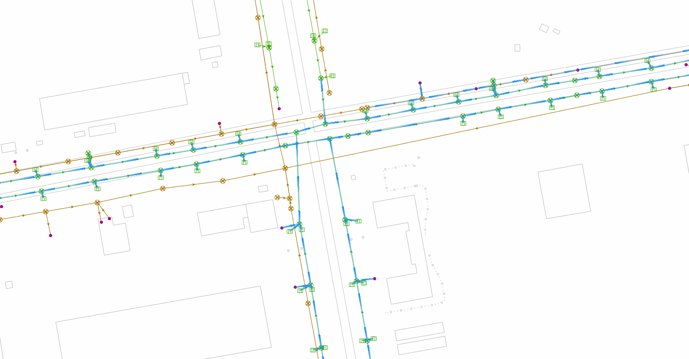

# 基于 WebGL 实现线流向动态效果

基于 geoscene js v4.23 版本，使用 WebGL 实现了线流向动态效果。参考 [Animated lines with WebGL | Sample Code | ArcGIS Maps SDK for JavaScript 4.29 | ArcGIS Developers](https://developers.arcgis.com/javascript/latest/sample-code/custom-gl-animated-lines/)。

## 效果



## 变更

### 坐标系转换

加入了坐标系自动更新机制。传入的 `geometry` 附上坐标对应的坐标系即可，无需另外转换。在地图切换坐标系时，也能自动更新几何坐标。

### 流向效果

1. 移除流向线两侧半透明效果
2. 增加了静态方法 `FlowlineLayer.combinePath(paths, tolerance = 1)`，可合并路径中端点重合且近似直线的线段
3. 增加了 `uniforms` 参数，用于控制流向效果。

   - u_width: 流向线宽度
   - u_speed: 流动倍速
   - u_length:  流光长度
   - u_min_num: 流光最小个数

### 首次渲染

测试时发现，geoscene v4.23 版本在加载图层时会触发地图 `stationary` 状态变更，从而进入正常加载流程。但在 v4.23.14 版本中发现，在加载图层后地图一直处于静止状态，无法进入正常渲染流程。

因此在图层进入 `attach` 时，设置 `needsUpdate = true` 强制渲染一次，以便正常渲染。

## 使用案例

``` js
 // 1. 创建 graphics
  const graphics = FlowlineLayer.combinePath(paths).map((item: any) => {
    return {
      attributes: {
        color: [24, 144, 255], // 路径颜色，接受rgb数组或hex字符串
      },
      geometry: {
        paths: [item],
        type: 'polyline',
        spatialReference: {
          wkid: 4326,
        },
      },
    };
  });
   // 2. 创建流向图层
  const flowlineLayer = new FlowlineLayer({
    graphics,
    uniforms: {
      u_speed: 1, // 流动倍速
      u_length: 10, // 流向长度
      u_min_num: 1, // 流光最小个数
      u_width: 4, // 流向宽度
    },
  });
   // 3. 添加图层
  map.layers.add(flowlineLayer);
```
